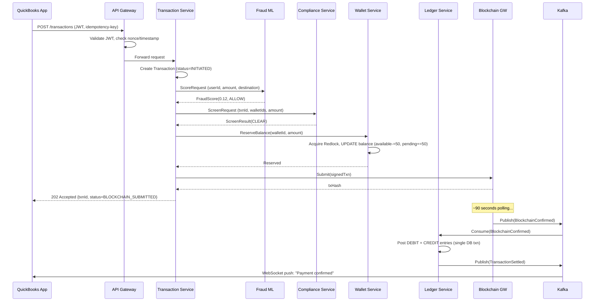

# Intuit Stablecoin Wallet — Complete System Design

**Author:** Mahendra Maraka | Staff Software Engineer  
**Version:** 1.0 | **Status:** Interview Design Document  
**Scope:** Global stablecoin wallet horizontal capability across QuickBooks, TurboTax, Credit Karma, MailChimp

---

## Table of Contents

1. [Executive Summary](#1-executive-summary)
2. [Customer Context & Problem Statement](#2-customer-context--problem-statement)
3. [Assumptions](#3-assumptions)
4. [Requirements](#4-requirements)
5. [Entity & Data Model](#5-entity--data-model)
6. [High-Level Architecture](#6-high-level-architecture)
7. [Service Design — Deep Dive](#7-service-design--deep-dive)
   - 7.1 [Wallet Service](#71-wallet-service)
   - 7.2 [Transaction Service & Saga Orchestration](#72-transaction-service--saga-orchestration)
   - 7.3 [Ledger Service — Double-Entry Design](#73-ledger-service--double-entry-design)
   - 7.4 [QR Payment Service — X9A Standard](#74-qr-payment-service--x9a-standard)
   - 7.5 [Compliance Service — KYC/AML/OFAC](#75-compliance-service--kycamlofac)
   - 7.6 [Blockchain Gateway](#76-blockchain-gateway)
8. [Caching Strategy](#8-caching-strategy)
9. [Authentication & Authorization](#9-authentication--authorization)
10. [Security Architecture](#10-security-architecture)
11. [AI / ML Components](#11-ai--ml-components)
12. [Reconciliation Pipeline](#12-reconciliation-pipeline)
13. [Scalability & Performance](#13-scalability--performance)
14. [Operational Excellence](#14-operational-excellence)
15. [End-to-End Use Cases](#15-end-to-end-use-cases)
16. [Key Technical Decisions & Alternatives](#16-key-technical-decisions--alternatives)
17. [API Reference](#17-api-reference)
18. [Sequence Diagrams](#18-sequence-diagrams)

---

## 1. Executive Summary

Intuit's stablecoin wallet is a **horizontal payment capability** — a single service that enables QuickBooks, TurboTax, Credit Karma, and MailChimp to offer multi-stablecoin (USDC, USDT, PYUSD) payments without each product building its own financial infrastructure.

**Why this matters:**
- QuickBooks SMB owners eliminate 3% FX fees on international supplier payments
- TurboTax filers receive tax refunds in seconds instead of 3 weeks
- Credit Karma users transfer money P2P with zero fees vs. Venmo's 1.75%
- MailChimp merchants accept global payments via X9A QR code

**Core design principle:** The wallet SDK hides every implementation detail from product teams. From their perspective: one API, one balance, one transaction history — regardless of which blockchain or payment rail executes underneath.

---

## 2. Customer Context & Problem Statement

### 2.1 User Personas

| Persona | Product | Primary Use Case | Key Design Impact |
|---------|---------|-----------------|-------------------|
| SMB Owner (Maria) | QuickBooks | Pay international suppliers, receive customer payments | Auto-reconcile to QB ledger; zero FX fees via stablecoin rails |
| Tax Filer (James) | TurboTax | Receive refund to wallet, pay estimated taxes | Instant settlement; link to TT tax records |
| Consumer (Priya) | Credit Karma | P2P payments, emergency savings in stablecoin | Near-zero fee P2P; spending insights from CK analytics |
| Merchant (Tom) | MailChimp | Accept payments globally via QR code | X9A QR standard; settlement flows to QB automatically |

### 2.2 Business Objectives

1. **Global payments** — eliminate FX fees and settlement delays for Intuit's 100M+ users
2. **Customer retention** — embed financial services so deeply that wallet creates product lock-in
3. **New revenue stream** — wallet transaction fees (0.1% on P2P) + stablecoin yield share
4. **Platform moat** — financial identity tied to Intuit; harder for competitors to replicate

### 2.3 Why Stablecoin (Not Traditional Rails)

| Traditional Rails | Stablecoin Rails |
|------------------|-----------------|
| ACH: T+1 to T+3 settlement | Ethereum: ~90s finality |
| Wire: $15-45 per transfer | Gas fee: ~$0.01-2.00 |
| Card: 2-3% interchange | Near-zero network fee |
| Not programmable | Smart contract automation |
| FX conversion required | USD-pegged, no conversion |

---

## 3. Assumptions

### 3.1 Scope Boundaries

- **In scope:** Wallet core, transaction processing, ledger, QR payments, compliance, AI fraud layer
- **Out of scope (Phase 1):** Fiat on/off-ramp (ACH bank funding), stablecoin yield products, cross-border fiat
- **Integration assumption:** Intuit SSO handles identity; wallet creates a linked account, never owns credentials
- **Blockchain assumption:** We build the gateway layer over existing blockchain nodes; we don't run validator nodes

### 3.2 Scale Assumptions

- **Peak load:** 500 TPS sustained; 1,500 TPS burst (3× for TurboTax tax season, QB month-end)
- **User base:** Initial 10M wallets; scale to 50M over 3 years
- **Transaction size:** 80th percentile < $500; 99th percentile < $10,000; tail up to $1M (wire-equivalent)
- **Geography:** US primary; EU and APAC within 12 months of launch

### 3.3 Team & Build Strategy

- Greenfield service, not migrating existing code
- Adopt Intuit's existing Kafka infrastructure, CI/CD pipelines, observability stack
- API-first: OpenAPI contracts committed to Git before any implementation
- Feature flag every stablecoin rail and every product integration

---

## 4. Requirements

### 4.1 Functional Requirements

| ID | Requirement | Priority |
|----|------------|---------|
| F1 | Create and manage multi-stablecoin wallets per Intuit user | P0 |
| F2 | P2P send/receive stablecoin between any two Intuit users | P0 |
| F3 | Send to external blockchain wallet address | P0 |
| F4 | Generate and scan X9A QR codes for merchant payments | P0 |
| F5 | Single wallet balance accessible across QB, TT, CK, MM | P0 |
| F6 | Full transaction history with status, timestamps, chain hash | P0 |
| F7 | Support USDC, USDT, PYUSD — extensible to new stablecoins | P0 |
| F8 | KYC at onboarding; continuous AML transaction monitoring | P0 |
| F9 | OFAC sanctions screening on every transaction | P0 |
| F10 | Real-time push/email/webhook notifications | P1 |
| F11 | Transaction dispute and reversal workflow | P1 |
| F12 | Spending analytics (Credit Karma integration) | P2 |

### 4.2 Non-Functional Requirements

| Category | Requirement | Measurement |
|----------|------------|-------------|
| **Throughput** | 500 TPS sustained | Load test at 150% before launch |
| **Latency** | P99 < 200ms for wallet ops | P99 < 50ms for fraud scoring |
| **Availability** | 99.99% uptime | < 52 minutes downtime/year |
| **Durability** | Zero transaction loss | Exactly-once semantics end-to-end |
| **Consistency** | Strong writes (ledger) | Eventual reads (balance display) |
| **Security** | PCI-DSS Level 1 equivalent | Annual third-party audit |
| **RTO** | < 5 minutes | Automated failover |
| **RPO** | < 30 seconds | Cross-region replication lag |
| **Scalability** | Linear scale with load | HPA on CPU + Kafka consumer lag |

---

## 5. Entity & Data Model

### 5.1 Core Entities

```sql
-- User: Intuit SSO user, linked to wallet
CREATE TABLE users (
    user_id         UUID PRIMARY KEY DEFAULT gen_random_uuid(),
    intuit_sso_id   VARCHAR(255) UNIQUE NOT NULL,  -- from Intuit SSO
    email           VARCHAR(255) UNIQUE NOT NULL,
    kyc_status      VARCHAR(50) NOT NULL DEFAULT 'PENDING',
        -- PENDING | SUBMITTED | VERIFIED | REJECTED | EXPIRED
    tier            VARCHAR(50) NOT NULL DEFAULT 'CONSUMER',
        -- CONSUMER | SMALL_BUSINESS | ENTERPRISE
    daily_limit     NUMERIC(20, 8) NOT NULL DEFAULT 10000.00,
    created_at      TIMESTAMPTZ NOT NULL DEFAULT NOW(),
    updated_at      TIMESTAMPTZ NOT NULL DEFAULT NOW()
);

-- Wallet: one per user (extensible to multiple)
CREATE TABLE wallets (
    wallet_id       UUID PRIMARY KEY DEFAULT gen_random_uuid(),
    user_id         UUID NOT NULL REFERENCES users(user_id),
    display_name    VARCHAR(100),
    status          VARCHAR(50) NOT NULL DEFAULT 'ACTIVE',
        -- ACTIVE | SUSPENDED | CLOSED
    created_at      TIMESTAMPTZ NOT NULL DEFAULT NOW(),
    CONSTRAINT uq_user_wallet UNIQUE (user_id)  -- Phase 1: one wallet per user
);

-- WalletBalance: one row per wallet per currency
-- DECISION: Separate table from Wallet to support multi-currency without schema change
CREATE TABLE wallet_balances (
    wallet_id           UUID NOT NULL REFERENCES wallets(wallet_id),
    currency            VARCHAR(20) NOT NULL,  -- USDC | USDT | PYUSD
    available_balance   NUMERIC(30, 8) NOT NULL DEFAULT 0,
    pending_balance     NUMERIC(30, 8) NOT NULL DEFAULT 0,
        -- Funds reserved for in-flight transactions
    version             BIGINT NOT NULL DEFAULT 0,  -- Optimistic lock version
    updated_at          TIMESTAMPTZ NOT NULL DEFAULT NOW(),
    PRIMARY KEY (wallet_id, currency),
    CONSTRAINT chk_available_non_negative CHECK (available_balance >= 0),
    CONSTRAINT chk_pending_non_negative   CHECK (pending_balance >= 0)
);

-- Transaction: the payment event (NOT the ledger)
-- DECISION: Transaction and LedgerEntry are separate.
-- Transaction = customer-visible record. LedgerEntry = accounting record.
CREATE TABLE transactions (
    txn_id              UUID PRIMARY KEY DEFAULT gen_random_uuid(),
    wallet_id           UUID NOT NULL REFERENCES wallets(wallet_id),
    counterparty_wallet_id UUID REFERENCES wallets(wallet_id),  -- NULL for external
    external_address    VARCHAR(255),       -- blockchain address if external
    type                VARCHAR(50) NOT NULL,
        -- SEND | RECEIVE | QR_PAYMENT | DEPOSIT | WITHDRAWAL
    amount              NUMERIC(30, 8) NOT NULL,
    currency            VARCHAR(20) NOT NULL,
    network_fee         NUMERIC(30, 8) NOT NULL DEFAULT 0,
    status              VARCHAR(50) NOT NULL DEFAULT 'INITIATED',
        -- INITIATED | FRAUD_CHECKED | KYC_VERIFIED | BALANCE_RESERVED |
        -- BLOCKCHAIN_SUBMITTED | BLOCKCHAIN_CONFIRMED | SETTLED | FAILED | REVERSED
    idempotency_key     VARCHAR(255) UNIQUE NOT NULL,  -- client-supplied, deduplication
    chain_tx_hash       VARCHAR(255),       -- blockchain transaction hash
    block_number        BIGINT,
    qr_id               UUID,              -- FK to qr_payment_requests if QR flow
    failure_reason      TEXT,
    metadata            JSONB,             -- extensible: gas price, route taken, etc.
    created_at          TIMESTAMPTZ NOT NULL DEFAULT NOW(),
    settled_at          TIMESTAMPTZ,
    INDEX idx_txn_wallet_id (wallet_id),
    INDEX idx_txn_idempotency (idempotency_key),
    INDEX idx_txn_status (status),
    INDEX idx_txn_created (created_at DESC)
);

-- LedgerEntry: the financial source of truth (append-only, immutable)
-- DECISION: Separate from Transaction. Ledger = accounting. Transaction = UX.
-- RULE: Never UPDATE or DELETE a ledger entry. Balance = SUM of all entries.
CREATE TABLE ledger_entries (
    entry_id            UUID PRIMARY KEY DEFAULT gen_random_uuid(),
    txn_id              UUID NOT NULL REFERENCES transactions(txn_id),
    wallet_id           UUID NOT NULL REFERENCES wallets(wallet_id),
    entry_type          VARCHAR(10) NOT NULL,  -- DEBIT | CREDIT
    amount              NUMERIC(30, 8) NOT NULL,
    currency            VARCHAR(20) NOT NULL,
    running_balance     NUMERIC(30, 8) NOT NULL,  -- Denormalized for audit
    idempotency_key     VARCHAR(255) NOT NULL,     -- Same as transaction's
    created_at          TIMESTAMPTZ NOT NULL DEFAULT NOW(),
    -- Immutability enforced: no UPDATE/DELETE privileges on this table
    CONSTRAINT chk_positive_amount CHECK (amount > 0),
    CONSTRAINT chk_entry_type      CHECK (entry_type IN ('DEBIT', 'CREDIT')),
    INDEX idx_ledger_wallet_id (wallet_id),
    INDEX idx_ledger_txn_id (txn_id),
    INDEX idx_ledger_created (created_at DESC)
);

-- QR Payment Request
CREATE TABLE qr_payment_requests (
    qr_id               UUID PRIMARY KEY DEFAULT gen_random_uuid(),
    merchant_wallet_id  UUID NOT NULL REFERENCES wallets(wallet_id),
    requested_amount    NUMERIC(30, 8) NOT NULL,
    currency            VARCHAR(20) NOT NULL,
    description         VARCHAR(500),
    x9a_payload         TEXT NOT NULL,      -- Full X9A-encoded signed payload
    ecdsa_signature     VARCHAR(512) NOT NULL,  -- ECDSA P-256 signature
    key_version         VARCHAR(50) NOT NULL,  -- Which key version signed this
    status              VARCHAR(50) NOT NULL DEFAULT 'OPEN',
        -- OPEN | USED | EXPIRED | CANCELLED
    expires_at          TIMESTAMPTZ NOT NULL,   -- QR lifetime (default: 10 min)
    scanned_by_user_id  UUID REFERENCES users(user_id),
    paid_txn_id         UUID REFERENCES transactions(txn_id),
    created_at          TIMESTAMPTZ NOT NULL DEFAULT NOW(),
    INDEX idx_qr_merchant (merchant_wallet_id),
    INDEX idx_qr_status   (status),
    INDEX idx_qr_expires  (expires_at)
);

-- Idempotency Keys: Redis-first, DB as fallback
-- Stored separately for fast lookup and TTL management
CREATE TABLE idempotency_keys (
    idempotency_key     VARCHAR(255) PRIMARY KEY,
    txn_id              UUID NOT NULL,
    result_status       VARCHAR(50) NOT NULL,
    created_at          TIMESTAMPTZ NOT NULL DEFAULT NOW(),
    expires_at          TIMESTAMPTZ NOT NULL DEFAULT NOW() + INTERVAL '24 hours'
);
```

### 5.2 Indexing Strategy

```sql
-- Composite index for transaction history (most common query)
CREATE INDEX idx_txn_wallet_created ON transactions(wallet_id, created_at DESC);

-- Partial index: only index active wallets (80% of queries)
CREATE INDEX idx_active_wallets ON wallets(user_id) WHERE status = 'ACTIVE';

-- Index for ledger balance reconstruction (rare but critical)
CREATE INDEX idx_ledger_wallet_currency ON ledger_entries(wallet_id, currency, created_at);

-- DECISION: No index on chain_tx_hash initially — low cardinality queries, 
-- add only when blockchain explorer feature is built
```

### 5.3 Sharding Strategy

```
Phase 1 (< 10M wallets): No sharding. PostgreSQL primary + 3 read replicas.
Phase 2 (10M-50M):       Hash shard by wallet_id modulo 8. Each shard on its own
                          PostgreSQL cluster. All queries include wallet_id.
Phase 3 (> 50M):         Consistent hashing with virtual nodes. Resharding without
                          full table scan. Consider CockroachDB migration at this scale.
```

---

## 6. High-Level Architecture

```
┌────────────────────────────────────────────────────────────────┐
│                    INTUIT PRODUCT APPS                         │
│  ┌──────────┐  ┌──────────┐  ┌─────────────┐  ┌──────────┐  │
│  │QuickBooks│  │ TurboTax │  │Credit Karma │  │MailChimp │  │
│  └──────────┘  └──────────┘  └─────────────┘  └──────────┘  │
└──────────────────────────┬─────────────────────────────────────┘
                           │ Wallet SDK (REST)
                           ▼
┌────────────────────────────────────────────────────────────────┐
│                   API GATEWAY LAYER                            │
│  mTLS · JWT Validation · Rate Limiting · Idempotency Check    │
│  Request Signing (HMAC-SHA256) · Nonce/Timestamp Replay Guard │
└──────────┬─────────────┬──────────────┬────────────┬──────────┘
           │             │              │            │
    ┌──────▼──┐   ┌──────▼──┐   ┌──────▼──┐  ┌────▼──────┐
    │ Wallet  │   │  Txn    │   │ Ledger  │  │QR Payment │
    │ Service │   │ Service │   │ Service │  │ Service   │
    └──────┬──┘   └──────┬──┘   └──────┬──┘  └────┬──────┘
           │             │              │            │
           └─────────────┴──────────────┴────────────┘
                                  │
                    ┌─────────────▼──────────────┐
                    │    APACHE KAFKA EVENT BUS  │
                    │  txn.events · ledger.entries│
                    │  compliance.events · notify │
                    │  blockchain.events · audit  │
                    └──────────────┬─────────────┘
                                   │
           ┌───────────┬───────────┼───────────┬───────────┐
           ▼           ▼           ▼           ▼           ▼
    ┌──────────┐ ┌──────────┐ ┌─────────┐ ┌────────┐ ┌────────┐
    │Compliance│ │Blockchain│ │ Fraud   │ │Notify  │ │Recon   │
    │ Service  │ │ Gateway  │ │ML Svc   │ │Service │ │Service │
    └──────┬───┘ └──────┬───┘ └────┬────┘ └────────┘ └────────┘
           │             │         │
    ┌──────▼───┐   ┌─────▼──┐ ┌───▼───────────┐
    │PostgreSQL│   │Ethereum│ │Feature Store  │
    │ Ledger   │   │Stellar │ │  (Redis)      │
    │ DB       │   │Gateway │ │               │
    └──────────┘   └────────┘ └───────────────┘

┌─────────────────────────────────────────────────────────────┐
│                  CROSS-CUTTING INFRASTRUCTURE               │
│  Redis Cluster · AWS CloudHSM · OpenTelemetry Tracing      │
│  Prometheus/Grafana · Kubernetes (EKS) · AWS Secrets Mgr   │
└─────────────────────────────────────────────────────────────┘
```

---

## 7. Service Design — Deep Dive

### 7.1 Wallet Service

**Responsibility:** Wallet lifecycle — create, retrieve, suspend, close. Balance management (read-through cache).

**Key design decisions:**

```java
// DECISION: One wallet per user in Phase 1, but schema supports N wallets.
// Why: We don't know yet if multi-wallet (personal + business) is needed.
// Alternative considered: Create separate wallets at account creation for each product.
//   Rejected: Complex to keep in sync; violates single source of truth principle.

@Service
public class WalletService {

    // DECISION: Balance is served from Redis cache (materialized view),
    // NOT computed from ledger entries on every request.
    // Alternative: Query SUM(amount) FROM ledger_entries on each balance read.
    //   Rejected: O(n) query over millions of entries. 8-second query observed at X Money.
    // Alternative: Store balance on wallet_balances table, update on each txn.
    //   Accepted: Combined with Redis cache. PostgreSQL is source of truth; Redis is fast path.
    public WalletBalance getBalance(UUID walletId, Currency currency) {
        String cacheKey = "balance:" + walletId + ":" + currency.name();
        
        // Redis read-through: if cache miss, load from PostgreSQL
        return redisCache.get(cacheKey, WalletBalance.class, () -> 
            walletBalanceRepository.findByWalletIdAndCurrency(walletId, currency)
                .orElseThrow(() -> new BalanceNotFoundException(walletId, currency))
        );
    }
    
    // DECISION: Optimistic locking on wallet_balances.version
    // Why: Multiple concurrent transactions on same wallet (possible but not common).
    // Alternative: SELECT FOR UPDATE (pessimistic locking at DB level).
    //   Rejected: Holds DB lock for duration of transaction including blockchain call.
    //   Blockchain calls can take 1-30 seconds. Holding DB lock that long is catastrophic.
    // Alternative: Redis Redlock for distributed mutex.
    //   Accepted for balance reservation step (fast, in-memory), 
    //   NOT for the full transaction lifecycle.
    @Transactional(isolation = Isolation.SERIALIZABLE)
    public void reserveBalance(UUID walletId, Currency currency, 
                                BigDecimal amount, long expectedVersion) {
        WalletBalance balance = walletBalanceRepository
            .findByWalletIdAndCurrencyForUpdate(walletId, currency);
        
        if (balance.getVersion() != expectedVersion) {
            throw new OptimisticLockException("Concurrent modification detected");
        }
        if (balance.getAvailableBalance().compareTo(amount) < 0) {
            throw new InsufficientFundsException(walletId, balance.getAvailableBalance(), amount);
        }
        
        balance.setAvailableBalance(balance.getAvailableBalance().subtract(amount));
        balance.setPendingBalance(balance.getPendingBalance().add(amount));
        balance.setVersion(expectedVersion + 1);
        walletBalanceRepository.save(balance);
        
        // Invalidate Redis cache — next read will reload from DB
        redisCache.evict("balance:" + walletId + ":" + currency.name());
    }
}
```

**Alternative architectures considered for balance:**

| Approach | Pros | Cons | Decision |
|----------|------|------|---------|
| Compute from ledger on read | Always accurate, simple write path | O(n) reads, slow at scale | ❌ Rejected |
| Store on wallet table, update in same txn | Simple, fast reads | Single table contention point | ✅ Accepted (+ Redis cache) |
| Event-sourced CQRS (separate read model) | Scales reads independently | Complex; eventual consistency | 🔄 Phase 2 if needed |
| Account-per-currency as separate accounts | Clean boundaries | Complex transfers, N×M schema | ❌ Rejected |

---

### 7.2 Transaction Service & Saga Orchestration

**Responsibility:** Orchestrates the multi-step payment flow using the Saga pattern.

**Why Saga over 2PC (Two-Phase Commit):**

| 2PC | Saga |
|-----|------|
| Coordinator holds locks across all services | Each service commits independently |
| Blocking: all services wait for coordinator | Non-blocking: compensating actions |
| Single point of failure | No SPOF |
| Does not work across different DBs | Works across heterogeneous systems |
| Cannot span blockchain calls | Works with any external system |

```
Transaction State Machine:

INITIATED ──[fraud_check_passed]──► FRAUD_CHECKED
    │                                      │
    │[fraud_blocked]              [kyc_verified]
    ▼                                      ▼
  FAILED                          KYC_VERIFIED
                                          │
                               [balance_reserved]
                                          ▼
                               BALANCE_RESERVED
                                          │
                               [blockchain_submitted]
                                          ▼
                              BLOCKCHAIN_SUBMITTED
                              /                    \
                [confirmed]                      [timed_out]
                    ▼                                  ▼
              CONFIRMED                          TIMED_OUT
                    │                                  │
              [ledger_posted]              [balance_released]
                    ▼                                  ▼
               SETTLED                            FAILED
```

**Saga Implementation (Choreography-based):**

```java
// DECISION: Choreography Saga (event-driven) over Orchestration Saga (central coordinator)
// Why choreography: No single orchestrator = no SPOF. Services are independently deployable.
// Alternative: Use a workflow engine (Temporal, Conductor).
//   Pros: Built-in retry, visibility, state persistence.
//   Cons: New infrastructure dependency; overkill for our flow complexity.
//   Revisit if we add >10 steps to the saga.

@KafkaListener(topics = "txn.events", groupId = "transaction-service")
public void handleTransactionEvent(TransactionEvent event) {
    switch (event.getType()) {
        case FRAUD_CHECK_PASSED -> initiateKycCheck(event.getTxnId());
        case KYC_VERIFIED       -> reserveBalance(event.getTxnId());
        case BALANCE_RESERVED   -> submitToBlockchain(event.getTxnId());
        case BLOCKCHAIN_CONFIRMED -> postToLedger(event.getTxnId());
        case FRAUD_BLOCKED,
             KYC_FAILED,
             BALANCE_INSUFFICIENT -> compensate(event.getTxnId(), event.getReason());
        case BLOCKCHAIN_TIMEOUT -> releaseReservedBalance(event.getTxnId());
    }
}

// Compensating action: undo balance reservation if downstream fails
private void compensate(UUID txnId, String reason) {
    Transaction txn = transactionRepository.findById(txnId);
    if (txn.getStatus() == BALANCE_RESERVED) {
        walletService.releaseReservation(txn.getWalletId(), txn.getCurrency(), txn.getAmount());
    }
    transactionRepository.updateStatus(txnId, FAILED, reason);
    eventPublisher.publish(new TransactionFailedEvent(txnId, reason));
}
```

**Outbox Pattern — eliminating dual-write:**

```java
// PROBLEM: We need to write to DB AND publish to Kafka atomically.
// If we write to DB then Kafka crashes: event lost. Inconsistent state.
// If we publish to Kafka then DB crashes: event with no backing record. Ghost transaction.

// SOLUTION: Outbox pattern. Write Kafka event to the DB in the SAME transaction.
// A Debezium CDC connector reads the outbox table and publishes to Kafka.

@Transactional
public Transaction createTransaction(CreateTransactionRequest req) {
    Transaction txn = buildTransaction(req);
    transactionRepository.save(txn);  // Step 1: save to transactions table
    
    // Step 2: write to outbox IN SAME TRANSACTION
    OutboxEvent outboxEvent = OutboxEvent.builder()
        .aggregateType("Transaction")
        .aggregateId(txn.getTxnId().toString())
        .eventType("TRANSACTION_INITIATED")
        .payload(toJson(txn))
        .build();
    outboxRepository.save(outboxEvent);
    
    // Debezium reads outbox table changes via CDC and publishes to Kafka.
    // If this transaction commits: both DB row and outbox event exist.
    // If this transaction rolls back: neither exists. Clean state.
    return txn;
}
```

---

### 7.3 Ledger Service — Double-Entry Design

**This is the financial source of truth. Every design decision here is conservative by default.**

**Core accounting rules:**
1. Every transaction produces exactly 2 ledger entries: DEBIT + CREDIT
2. Entries are immutable — no UPDATE or DELETE ever
3. DEBIT + CREDIT for any transaction must sum to zero (balanced)
4. Balance = SUM(CREDIT amount) - SUM(DEBIT amount) for a wallet

```java
// DECISION: NUMERIC(30,8) for all monetary amounts.
// Why: BigDecimal in Java; NUMERIC in PostgreSQL. Exact decimal representation.
// Alternative: Store as long (integer cents).
//   Pros: Faster arithmetic, no decimal complexity.
//   Cons: Stablecoin has 8 decimal places (1 USDC = 100,000,000 units).
//         Using integer arithmetic would require 10^8 multiplier — error-prone.
// Alternative: Store as string.
//   Rejected: Cannot perform SUM() or comparison in DB.

@Service
public class LedgerService {

    @Transactional(isolation = Isolation.SERIALIZABLE)
    public void postTransaction(PostLedgerRequest req) {
        // Idempotency check: if we've already posted this, return the existing entries
        if (ledgerRepository.existsByIdempotencyKey(req.getIdempotencyKey())) {
            log.info("Duplicate ledger post detected, returning existing. key={}", 
                     req.getIdempotencyKey());
            return;
        }
        
        // DECISION: Verify accounting balance before posting
        // The sum of debit amount and credit amount must equal zero.
        // This is a runtime invariant check — not just compile-time.
        BigDecimal netAmount = req.getCreditAmount().subtract(req.getDebitAmount());
        if (netAmount.compareTo(BigDecimal.ZERO) != 0) {
            throw new UnbalancedLedgerException(req.getTxnId(), netAmount);
        }
        
        // Post DEBIT entry (sender)
        LedgerEntry debit = LedgerEntry.builder()
            .txnId(req.getTxnId())
            .walletId(req.getSenderWalletId())
            .entryType(EntryType.DEBIT)
            .amount(req.getDebitAmount())
            .currency(req.getCurrency())
            .idempotencyKey(req.getIdempotencyKey() + "-DEBIT")
            .build();
        
        // Post CREDIT entry (receiver)
        LedgerEntry credit = LedgerEntry.builder()
            .txnId(req.getTxnId())
            .walletId(req.getReceiverWalletId())
            .entryType(EntryType.CREDIT)
            .amount(req.getCreditAmount())
            .currency(req.getCurrency())
            .idempotencyKey(req.getIdempotencyKey() + "-CREDIT")
            .build();
        
        ledgerRepository.saveAll(List.of(debit, credit));
        
        // Update materialized balances (in same transaction)
        walletBalanceRepository.subtractFromAvailable(req.getSenderWalletId(), 
                                                       req.getCurrency(), req.getDebitAmount());
        walletBalanceRepository.addToAvailable(req.getReceiverWalletId(), 
                                               req.getCurrency(), req.getCreditAmount());
        walletBalanceRepository.subtractFromPending(req.getSenderWalletId(),
                                                    req.getCurrency(), req.getDebitAmount());
        
        // Publish outbox event (same transaction — Outbox pattern)
        outboxRepository.save(new OutboxEvent("LedgerPosted", req.getTxnId()));
        
        log.info("Ledger posted. txnId={}, sender={}, receiver={}, amount={} {}",
                 req.getTxnId(), req.getSenderWalletId(), req.getReceiverWalletId(),
                 req.getCreditAmount(), req.getCurrency());
    }
    
    // Balance reconstruction: used for audits and drift detection
    // DECISION: Balance reconstruction from ledger should match wallet_balances materialized view.
    // Run this nightly and alert on any discrepancy > $0.00.
    public BigDecimal reconstructBalance(UUID walletId, Currency currency) {
        return ledgerRepository
            .sumByWalletAndCurrency(walletId, currency.name(), EntryType.CREDIT)
            .subtract(
                ledgerRepository.sumByWalletAndCurrency(walletId, currency.name(), EntryType.DEBIT)
            );
    }
}
```

**Why we chose this over alternatives:**

```
ALTERNATIVE 1: Event sourcing only (no wallet_balances table)
  + Pure event sourcing: balance always computed from events
  - Querying balance = full table scan over ledger_entries for that wallet
  - At 100M transactions: this query takes minutes, not milliseconds
  - Verdict: REJECTED. Impractical at our scale.

ALTERNATIVE 2: Blockchain as ledger (trust on-chain balance)
  + Eliminates off-chain ledger complexity
  - On-chain query latency: 100ms-2s per balance read
  - Cannot query across multiple wallets efficiently
  - No AML/audit trail in format regulators require
  - Verdict: REJECTED. On-chain is settlement; off-chain is accounting.

ALTERNATIVE 3: NoSQL (DynamoDB) for ledger
  + Horizontally scalable writes
  - Eventually consistent reads: two concurrent reads could see different balances
  - No native SUM() aggregation: must scan and compute in application
  - Cannot enforce accounting invariants (DEBIT + CREDIT = 0) at DB level
  - Verdict: REJECTED. Financial ledger requires ACID. Period.

CHOSEN: PostgreSQL double-entry with Redis materialized balance cache
  + ACID guarantees on writes
  + Fast balance reads from Redis
  + Nightly drift detection (ledger vs. cache)
  + Regulatory-grade audit trail
```

---

### 7.4 QR Payment Service — X9A Standard

**X9A QR Code Standard:**
X9A is the ANSI-accredited standard for financial services QR codes. A compliant payload is a signed JSON object encoding payment metadata, interpretable by any compliant reader.

```java
// X9A QR Payload Structure
public record X9APayload(
    String version,          // "X9A-1.0"
    String merchantWalletId, // Wallet UUID
    BigDecimal amount,       // Locked at generation — cannot be modified
    String currency,         // "USDC" | "USDT" | "PYUSD"
    String nonce,            // UUID — replay prevention
    Instant expiresAt,       // Generation time + 10 minutes
    String description,      // Human-readable (optional)
    String signature         // ECDSA P-256 signature over canonical JSON
) {}

@Service
public class QrPaymentService {

    private final HsmKeyService hsmKeyService;   // Keys never leave HSM
    private final RedisTemplate<String, String> redis;

    // DECISION: QR payload signed with merchant's wallet key (asymmetric, ECDSA P-256)
    // Why ECDSA over HMAC: ECDSA allows any reader to verify with public key.
    //   HMAC requires sharing the secret key — not safe for a merchant-facing standard.
    // Why P-256 (not P-521 or Ed25519):
    //   P-256 is FIPS 140-2 compliant (required for financial services).
    //   Ed25519 is faster but not FIPS-approved. P-521 is slower with marginal security gain.
    public QrPaymentResponse generateQrCode(GenerateQrRequest req) {
        // Validate wallet is active and merchant-tier
        Wallet wallet = walletService.getWalletOrThrow(req.getMerchantWalletId());
        
        // Build canonical payload (deterministic field ordering for consistent signing)
        X9APayload payload = X9APayload.builder()
            .version("X9A-1.0")
            .merchantWalletId(req.getMerchantWalletId().toString())
            .amount(req.getAmount())
            .currency(req.getCurrency().name())
            .nonce(UUID.randomUUID().toString())  // Replay prevention
            .expiresAt(Instant.now().plus(10, MINUTES))
            .description(req.getDescription())
            .build();
        
        // Sign in HSM — private key never in application memory
        String canonicalJson = toCanonicalJson(payload);
        String signature = hsmKeyService.sign(wallet.getKeyId(), canonicalJson);
        
        X9APayload signedPayload = payload.withSignature(signature);
        
        // Store in Redis for fast lookup during scan (avoids DB hit on scan path)
        redis.opsForValue().set(
            "qr:" + signedPayload.getNonce(),
            toJson(signedPayload),
            10, TimeUnit.MINUTES  // Same TTL as QR expiry
        );
        
        // Persist to DB for audit trail
        qrRepository.save(buildQrEntity(signedPayload));
        
        // Encode to QR image (ZXing library)
        byte[] qrImage = qrEncoder.encode(toCanonicalJson(signedPayload));
        return new QrPaymentResponse(signedPayload.getNonce(), Base64.encode(qrImage));
    }

    // DECISION: Nonce stored in Redis and checked on scan — single-use enforcement
    // Why: A valid QR could be replayed (scan, pay, save, scan again).
    // The nonce in Redis is deleted on successful payment — second scan finds no nonce = rejected.
    public QrValidationResult validateAndInitiatePayment(ScanQrRequest req, UUID payerUserId) {
        // Step 1: Parse payload
        X9APayload payload = parsePayload(req.getQrData());
        
        // Step 2: Check expiry
        if (Instant.now().isAfter(payload.getExpiresAt())) {
            return QrValidationResult.expired();
        }
        
        // Step 3: Verify nonce has not been used (atomic check-and-delete in Redis)
        Boolean nonceConsumed = redis.execute(consumeNonceScript, 
                                              List.of("qr:" + payload.getNonce()));
        if (!Boolean.TRUE.equals(nonceConsumed)) {
            return QrValidationResult.alreadyUsed();  // Replay detected
        }
        
        // Step 4: Verify ECDSA signature
        String merchantPublicKey = hsmKeyService.getPublicKey(
            payload.getMerchantWalletId(), payload.getKeyVersion());
        if (!ecdsaVerifier.verify(toCanonicalJson(payload.withoutSignature()), 
                                  payload.getSignature(), merchantPublicKey)) {
            return QrValidationResult.invalidSignature();
        }
        
        // Step 5: Initiate payment (reuse P2P flow)
        return transactionService.initiateTransfer(
            payerUserId, UUID.fromString(payload.getMerchantWalletId()),
            payload.getAmount(), payload.getCurrency(),
            "qr-payment-" + payload.getNonce()  // Idempotency key
        );
    }
}
```

---

### 7.5 Compliance Service — KYC/AML/OFAC

```java
// DECISION: Compliance Service is synchronous for OFAC screening,
//           asynchronous for AML monitoring.
// Why: OFAC screening failure = legal violation if we allow the transaction.
//      Must be blocking. AML is risk-scoring; a delayed score is acceptable.

@Service  
public class ComplianceService {

    // OFAC: Synchronous, exact-match, blocking
    // DECISION: Use vendor (Chainalysis + OFAC SDN list) not in-house.
    // Why: OFAC list changes daily. Vendor handles update cadence and covers
    //      both wallet address screening AND entity name screening.
    // Alternative: Maintain our own SDN list and hash-lookup.
    //   Pros: Lower cost, no vendor dependency.
    //   Cons: We'd need to handle list updates, fuzzy name matching, 
    //         blockchain address clustering. Not our core competency.
    public OfacResult screenTransaction(UUID txnId, String recipientAddress, 
                                         String recipientName) {
        // Primary: exact hash match against OFAC SDN addresses
        OfacResult addressResult = chainalysisClient.screenAddress(recipientAddress);
        if (addressResult.isHit()) {
            log.warn("OFAC SDN address hit. txnId={}, address={}", txnId, recipientAddress);
            auditLogger.logOfacHit(txnId, recipientAddress);
            return OfacResult.BLOCKED;
        }
        
        // Secondary: fuzzy name match for entity screening
        if (recipientName != null) {
            OfacResult nameResult = ofacNameScreener.screen(recipientName);
            if (nameResult.isHit()) {
                return OfacResult.PENDING_REVIEW;  // Human review, not auto-block
            }
        }
        return OfacResult.CLEAR;
    }

    // AML: Asynchronous, ML-based, continuous monitoring
    // Runs as Kafka consumer on every settled transaction
    @KafkaListener(topics = "txn.settled", groupId = "compliance-aml")
    public void runAmlMonitoring(TransactionSettledEvent event) {
        AmlRiskScore score = amlModel.score(event);
        
        if (score.getValue() > AML_HIGH_RISK_THRESHOLD) {
            // Flag for SAR (Suspicious Activity Report) workflow
            sarWorkflowService.initiateReview(event.getTxnId(), score);
        }
        
        // Structuring detection: check if this transaction is part of a 
        // pattern designed to evade $10,000 reporting threshold
        if (isStructuringPattern(event.getWalletId(), event.getAmount())) {
            sarWorkflowService.flagStructuring(event.getWalletId());
        }
    }
    
    // Structuring: breaking up large amounts into smaller transactions to avoid BSA reporting
    private boolean isStructuringPattern(UUID walletId, BigDecimal amount) {
        if (amount.compareTo(STRUCTURING_THRESHOLD) >= 0) return false; // Not a small transaction
        
        BigDecimal total24h = transactionRepository
            .sumSettledLast24Hours(walletId, amount.getCurrency());
        
        return total24h.compareTo(BSA_REPORTING_THRESHOLD) >= 0 && 
               amount.compareTo(BSA_REPORTING_THRESHOLD) < 0;
    }
}
```

---

### 7.6 Blockchain Gateway

```java
// DECISION: Abstract blockchain networks behind a unified Gateway interface.
// Why: Product code never references "Ethereum" or "Stellar" directly.
//      Switching networks or adding new ones = config change, not code change.

public interface BlockchainGateway {
    SubmissionResult submit(BlockchainTransaction txn);
    ConfirmationResult getConfirmation(String txHash);
    NetworkStatus getNetworkStatus();
    BigDecimal estimateGasFee(BigDecimal amount, String toAddress);
}

// DECISION: Confirmations required per transaction size:
// < $100:    1 confirmation  (~15 seconds on Ethereum)
// $100-10K:  6 confirmations (~90 seconds)
// > $10K:   12 confirmations (~3 minutes)
// Why: More confirmations = lower reorg risk. Higher-value txns justify the wait.
// Alternative: Always wait for 6. Simpler but slower for small transactions.

@Service
public class EthereumGateway implements BlockchainGateway {
    
    private final CircuitBreaker circuitBreaker;  // Fail fast on Ethereum outage
    
    @Override
    public SubmissionResult submit(BlockchainTransaction txn) {
        return circuitBreaker.executeSupplier(() -> {
            // DECISION: Use private mempool (Flashbots) for transactions > $10K
            // Why: Public mempool exposes pending transactions to front-runners.
            //      MEV (Maximal Extractable Value) bots can sandwich-attack large swaps.
            if (txn.getAmount().compareTo(PRIVATE_MEMPOOL_THRESHOLD) > 0) {
                return flashbotsClient.submit(txn);
            }
            return web3jClient.ethSendRawTransaction(txn.getSignedHex()).send();
        });
    }
    
    // DECISION: Exponential backoff with jitter for confirmation polling
    // Why: Fixed-interval polling thunders the RPC node if many transactions confirm simultaneously.
    // Jitter spreads the load. Max 3 retries, then TIMEOUT → compensating action.
    @Override
    public ConfirmationResult getConfirmation(String txHash) {
        int requiredConfirmations = getRequiredConfirmations(txHash);
        RetryPolicy<ConfirmationResult> policy = RetryPolicy.<ConfirmationResult>builder()
            .handleResultIf(r -> r.getConfirmations() < requiredConfirmations)
            .withBackoff(2, 30, ChronoUnit.SECONDS)
            .withJitter(0.25)
            .withMaxAttempts(40)  // 40 attempts ≈ 30 minutes max wait
            .build();
        return Failsafe.with(policy).get(() -> fetchConfirmation(txHash));
    }
}
```

---

## 8. Caching Strategy

```
Layer 1: API Gateway (Nginx)
  - Cache: GET /wallet/balance responses for 5 seconds
  - Why: Balance display in UI — slight staleness acceptable; 5 seconds prevents thundering herd
  - Not cached: Any POST/PUT; any request with wallet:send scope

Layer 2: Redis Cluster (6 nodes: 3 primary, 3 replica)
  - Balance cache: KEY=balance:{walletId}:{currency}, TTL=5min
  - Idempotency keys: KEY=idempotency:{key}, TTL=24h, set with SETNX
  - Fraud scores: KEY=fraud_score:{userId}, TTL=30s (acceptable staleness for most users)
  - QR payloads: KEY=qr:{nonce}, TTL=10min (matches QR expiry)
  - userId→walletId mapping: KEY=wallet_map:{userId}, TTL=1h (rarely changes)

Layer 3: JVM in-process cache (Caffeine)
  - Public keys for ECDSA verification: Caffeine cache, max 1000 entries, TTL=1h
  - Why: Key lookup happens on every QR scan; HSM call is slow (~10ms)
  - Risk: If a key is rotated, old entry cached for up to 1h. Acceptable — rotation has 24h overlap window.
```

**Cache invalidation:**

```java
// DECISION: Cache-aside pattern (not write-through) for balance
// Why: Write-through requires the cache to be available for writes to succeed.
//      If Redis is down, payments should still process (PostgreSQL is source of truth).
// Pattern: Write to DB, invalidate cache, next read refreshes from DB.

@Transactional
public void updateBalance(UUID walletId, Currency currency, BigDecimal delta) {
    walletBalanceRepository.addToAvailable(walletId, currency, delta);
    // Invalidate — don't update. Avoids race condition where old value is written after new.
    redisCache.evict("balance:" + walletId + ":" + currency.name());
}
```

---

## 9. Authentication & Authorization

```
OAuth 2.0 / OIDC Flow:

User ──[login]──► Intuit SSO ──[OIDC token]──► App
App  ──[Bearer token]──► API Gateway
API Gateway ──[validate]──► Intuit JWKS endpoint
  Check: signature valid, exp not passed, iss = "https://sso.intuit.com", 
         aud = "wallet-service", scope includes requested action

Token structure:
{
  "sub": "user-uuid",
  "iss": "https://sso.intuit.com",
  "aud": "wallet-service",
  "exp": <now + 900>,     // 15 minutes
  "iat": <now>,
  "scope": "wallet:read wallet:send",
  "intuit_product": "quickbooks",
  "kyc_status": "VERIFIED"   // Embedded — no DB call for KYC gate
}

DECISION: Embed kyc_status in JWT.
Why: Every payment request checks KYC status. DB call on each request adds 5-10ms.
Risk: JWT is stale if KYC status changes within 15-minute window.
Mitigation: KYC revocation (REJECTED status) triggers immediate token revocation via
            Redis revocation list. All subsequent requests check this list.

RBAC Scopes:
  wallet:read   → GET /wallet, GET /wallet/balance, GET /wallet/transactions
  wallet:send   → POST /wallet/transactions, POST /wallet/qr/pay
  wallet:kyc    → POST /wallet/kyc (onboarding flow only)
  wallet:admin  → POST /wallet/suspend (service accounts only, not user-facing)

Step-up Authentication (re-verify within active session):
  Trigger                        → Required action
  Send > $1,000                  → Biometric re-verification (Touch ID / Face ID)
  First send to new address      → Email OTP confirmation
  New device within 24 hours     → 24-hour hold on large sends
  Failed fraud check             → Manual identity reverification
  Account dormant > 90 days      → Re-authenticate before any action
```

---

## 10. Security Architecture

### 10.1 Threat Model

| Threat | Attack Vector | Mitigation |
|--------|--------------|------------|
| Stolen credentials | Phishing, credential stuffing | Short JWT TTL (15 min) + refresh token rotation |
| Man-in-the-middle | Network interception | TLS 1.3 everywhere + HSTS preloading |
| Replay attack | Resend valid signed request | Nonce + timestamp; reject if >5 minutes old |
| QR code tampering | Modify amount in QR before scan | ECDSA signature over full payload; amount locked |
| Insider threat | Direct DB access | Immutable ledger + WORM audit log + four-eyes for production access |
| Blockchain front-running | Observe mempool, front-run | Private mempool (Flashbots) for large transactions |
| Key compromise | HSM breach | HSM never exports private keys; compromise requires physical access |
| Account takeover | Session hijack, SIM swap | Step-up auth; anomalous access detection |

### 10.2 Key Management

```
Key Hierarchy:
  AWS CloudHSM (FIPS 140-2 Level 3)
  │
  ├── Master Key (never leaves HSM; rotates annually with ceremony)
  │   └── signs all derived keys
  │
  ├── JWT Signing Keys (RSA-2048)
  │   └── Rotates every 90 days
  │   └── Old key valid until all issued tokens expire (15 min overlap)
  │
  ├── Wallet Signing Keys (ECDSA P-256, one per user wallet)
  │   └── Generated on wallet creation
  │   └── Application submits signing request to HSM; key never leaves
  │   └── Rotates annually; old public key retained for QR verification
  │
  └── Data Encryption Keys (AES-256-GCM)
      └── Used for field-level encryption of PII
      └── Rotates every 6 months; old key retained for decryption

DECISION: Per-wallet ECDSA keys (not a shared signing key).
Why: If a shared key is compromised, all QR codes are forgeable.
     Per-wallet key compromise scope = one merchant.
Tradeoff: More keys to manage. Mitigated by HSM + key management service.
```

### 10.3 Data Privacy

```java
// DECISION: PII minimization in ledger entries.
// Ledger entries contain only wallet IDs — never email, name, phone.
// PII lives in User Service, encrypted at field level.

// Field-level encryption for high-sensitivity fields
@Entity
public class User {
    @Encrypted  // Custom annotation; encrypts at JPA level using DEK from HSM
    private String email;
    
    @Encrypted
    private String phoneNumber;
    
    // Ledger never contains these — only user_id
}

// Log masking: no PII in log output
private String maskWalletAddress(String address) {
    // "0x1234...5678" → "0x12**...5678"
    return address.substring(0, 4) + "**..." + address.substring(address.length() - 4);
}
```

---

## 11. AI / ML Components

### 11.1 Fraud Scoring — XGBoost in the Authorization Path

**Decision: XGBoost over neural network**

| Criterion | XGBoost | Neural Net | Winner |
|-----------|---------|------------|--------|
| Inference latency | <10ms CPU | 50-200ms GPU | XGBoost |
| Interpretability | Feature importance | Black box | XGBoost |
| Training speed | Minutes | Hours | XGBoost |
| Regulatory explainability | ✅ Yes | ❌ Hard | XGBoost |
| Graph/pattern features | ❌ Limited | ✅ Strong (via embeddings) | Neural Net |
| **Verdict** | Primary model | Graph embedding input only | XGBoost + embedding features |

```python
# Feature Engineering — Online Feature Store (Redis)
FRAUD_FEATURES = {
    # Velocity features (computed by Kafka Streams, stored in Redis)
    "txn_count_1h":           "COUNT of transactions in last 1 hour",
    "txn_count_24h":          "COUNT of transactions in last 24 hours", 
    "txn_amount_sum_1h":      "SUM of transaction amounts in last 1 hour",
    "unique_recipients_24h":  "COUNT DISTINCT recipients in last 24 hours",
    
    # Amount features
    "amount_percentile_90d":  "Where this txn amount sits in user's 90-day distribution",
    "amount_zscore":          "Z-score of this amount vs user's mean (Welford's algorithm)",
    "is_round_number":        "Flag: amount ends in 00 or 000 (structuring signal)",
    
    # Context features
    "is_new_counterparty":    "Boolean: first transaction with this recipient",
    "device_fingerprint_match": "Boolean: same device as last 10 transactions",
    "geo_velocity_possible":  "Boolean: could user physically be in this location given last txn?",
    "account_age_days":       "Days since wallet created",
    "days_since_last_txn":    "Days since previous transaction",
    
    # Stablecoin-specific
    "dest_address_risk_score": "Chainalysis risk score for destination blockchain address",
    "dest_is_exchange":        "Boolean: is recipient address a known exchange?",
    "dest_is_mixer":           "Boolean: is recipient address a known mixing service?",
    "network_congestion":      "Current gas price vs 30-day moving average",
}

# DECISION: Welford's online algorithm for running mean/variance
# Why: Cannot store all historical amounts in Redis — memory prohibitive.
#      Welford's computes running statistics with O(1) space and O(1) update.
# Alternative: Approximate using T-Digest. More accurate for tail percentiles.
# Chosen for now: Welford's. Switch to T-Digest if percentile accuracy becomes an issue.
```

```java
// Model serving: ONNX runtime (JVM-native, no Python process)
// DECISION: ONNX over Python microservice
// Why: Eliminates serialization overhead (Java → Python → Java).
//      Single JVM process. ~30ms faster per inference call.
// Alternative: TorchServe, TensorFlow Serving.
//   Both require a separate process. Network hop + serialization adds latency.

@Service
public class FraudScoringService {
    
    private final OrtSession xgboostSession;  // ONNX Runtime session
    private final RedisTemplate<String, Map<String, Double>> featureStore;
    
    public FraudScore score(UUID userId, BigDecimal amount, String currency, 
                             String destinationAddress) {
        // Fetch all features in ONE Redis call (HGETALL) — no multiple round trips
        Map<String, Double> features = featureStore.opsForHash()
            .entries("fraud_features:" + userId);
        
        // Add request-time features (not pre-computable)
        features.put("amount", amount.doubleValue());
        features.put("is_new_counterparty", isNewCounterparty(userId, destinationAddress) ? 1.0 : 0.0);
        features.put("dest_address_risk_score", getAddressRiskScore(destinationAddress));
        
        // ONNX inference — sub-10ms
        float[] inputArray = buildInputArray(features);
        OnnxTensor inputTensor = OnnxTensor.createTensor(env, new float[][]{inputArray});
        float[] output = (float[]) xgboostSession.run(Map.of("input", inputTensor))
                                                  .get("output").getValue();
        
        double score = output[1];  // Probability of fraud (class 1)
        
        FraudAction action;
        if (score < 0.60)      action = FraudAction.ALLOW;
        else if (score < 0.80) action = FraudAction.CHALLENGE;  // Require step-up auth
        else                   action = FraudAction.BLOCK;
        
        // Log for training data collection (no PII in logs — only IDs and score)
        fraudAuditLogger.log(userId, amount, score, action);
        
        return new FraudScore(score, action, buildExplanation(features, output));
    }
    
    // Regulatory explainability: top 3 features driving the score
    private String buildExplanation(Map<String, Double> features, float[] shap) {
        // SHAP values from XGBoost give per-feature contribution to score
        // Required for adverse action notice if we block a transaction
        return topFeaturesByShapValue(features, shap, 3)
            .stream()
            .map(f -> f.getFeatureName() + ": " + f.getHumanReadableValue())
            .collect(joining(", "));
    }
}
```

### 11.2 AML — Unsupervised Anomaly Detection

```python
# Isolation Forest for structuring and novel fraud pattern detection
# DECISION: Unsupervised (Isolation Forest) NOT supervised (labeled fraud)
# Why: AML structuring patterns are designed to look normal individually.
#      Supervised models trained on labeled fraud miss patterns they haven't seen.
#      Isolation Forest detects statistical anomalies without needing labels.
# Alternative: DBSCAN clustering. Better for dense clusters, worse for high-dimensional data.
# Alternative: Autoencoder (neural net). High reconstruction error = anomaly.
#   Would use if we needed temporal pattern detection across weeks.

from sklearn.ensemble import IsolationForest

STRUCTURING_FEATURES = [
    'amount',
    'time_since_last_txn_hours',
    'daily_txn_count',
    'cumulative_daily_amount',
    'recipient_uniqueness_score',    # Entropy of recipient distribution
    'amount_variance_7d',
    'txn_hour_of_day',               # Unusual hours signal automated behavior
    'is_threshold_adjacent',         # Amount within 5% of reporting threshold
]
```

### 11.3 Smart Rail Routing — ML-Powered

```python
# Gradient Boosting Regressor predicting (cost, latency) per rail
# DECISION: Two separate models (cost prediction, latency prediction)
#           rather than one multi-output model.
# Why: Different features matter for cost vs. latency.
#      Separate models are easier to retrain and explain independently.
# Fallback (always available): Rule-based router
#   IF amount < $100: route to lowest-fee rail
#   IF amount > $100: route to fastest confirmation rail
#   IF ML service latency > 100ms: use rule-based fallback immediately

ROUTING_FEATURES = {
    'eth_gas_price_gwei':       'Current Ethereum gas price',
    'eth_gas_price_vs_7d_avg':  'Gas price relative to 7-day average',
    'stellar_fee_stroops':      'Current Stellar transaction fee',
    'amount_usd':               'Transaction amount in USD',
    'recipient_network':        'Which network the recipient wallet is on',
    'time_of_day':              'Hour (some networks congested at specific times)',
    'confirmation_urgency':     'How fast does the customer need confirmation?',
}
```

---

## 12. Reconciliation Pipeline

```
PROBLEM: External payment partners (blockchain networks, ACH, custodians)
settle transactions independently. Our internal ledger must match.
Manual reconciliation at X Money: 2-day lag, 20 hours/week of engineering time.

SOLUTION: Automated reconciliation pipeline

Architecture:
  ┌─────────────────┐     ┌──────────────┐     ┌─────────────────┐
  │  Partner Files  │────►│ Ingestion    │────►│ Matching Engine │
  │  (SFTP / API)   │     │ Service      │     │                 │
  └─────────────────┘     └──────────────┘     └────────┬────────┘
                                                         │
                         ┌───────────────────────────────┤
                         ▼                               ▼
                  ┌─────────────┐               ┌─────────────────┐
                  │  MATCHED    │               │  EXCEPTIONS     │
                  │  (auto-post)│               │  (classified)   │
                  └─────────────┘               └────────┬────────┘
                                                         │
                                    ┌────────────────────┤
                                    ▼                    ▼
                             ┌────────────┐      ┌──────────────┐
                             │  AUTO-     │      │  HUMAN       │
                             │  RESOLVE   │      │  REVIEW      │
                             └────────────┘      └──────────────┘
```

```java
@Service
public class ReconciliationService {

    // DECISION: Idempotent matching — running recon twice must produce same result
    // Why: Partner files are often re-delivered. Double-processing = double-posting.
    // Implementation: Check if settlement_reference already matched before processing.
    
    public ReconciliationResult reconcile(PartnerSettlementFile file) {
        List<ReconciliationResult> results = new ArrayList<>();
        
        for (SettlementRecord record : file.getRecords()) {
            // Check if this settlement reference was already processed
            if (reconRepository.existsBySettlementReference(record.getReference())) {
                results.add(ReconciliationResult.alreadyProcessed(record));
                continue;
            }
            
            // Attempt to match to internal transaction
            Optional<Transaction> match = findMatch(record);
            
            if (match.isPresent()) {
                results.add(handleMatch(record, match.get()));
            } else {
                results.add(classifyException(record));
            }
        }
        return ReconciliationResult.summary(results);
    }
    
    private ReconciliationResult classifyException(SettlementRecord record) {
        // TIMING_GAP: transaction exists but hasn't confirmed yet (normal, auto-retry at T+1)
        // DUPLICATE: same transaction submitted twice (investigate source)
        // PARTNER_MISMATCH: amount differs by > $0.01 (investigate immediately)
        // AMOUNT_DIFF < $0.01: rounding difference (auto-resolve, log for audit)
        // UNKNOWN: no matching transaction found (create investigation ticket)
        
        ExceptionType type = classifyByRules(record);
        if (type == ExceptionType.TIMING_GAP) {
            reconRetryQueue.add(record, Duration.ofHours(24));
            return ReconciliationResult.deferred(record, type);
        }
        if (type == ExceptionType.AMOUNT_DIFF_ROUNDING) {
            ledgerService.postRoundingAdjustment(record);
            return ReconciliationResult.autoResolved(record, type);
        }
        return escalationService.createReviewTicket(record, type);
    }
}
```

**KPIs for reconciliation health:**
- Match rate: target > 99.5%
- Time to exception detection: < 1 hour after partner file delivery
- Time to exception resolution: < 24 hours for TIMING_GAP; < 4 hours for PARTNER_MISMATCH
- Manual intervention rate: < 0.1% of transactions

---

## 13. Scalability & Performance

### 13.1 Kafka Partition Strategy

```
Topic: txn.events
  Partition key: walletId
  Partition count: 50 (initial); scale to 200 at 50M users
  Why partition by walletId: Guarantees ordering per wallet.
  A user's SEND must be processed before their second SEND (balance check requires it).
  
  Partition count calculation:
  Target: 500 TPS × 2 (DEBIT + CREDIT events per txn) = 1,000 events/sec
  Target consumer throughput per partition: 50 events/sec
  Partitions needed: 1,000 / 50 = 20 minimum
  Buffer for growth: 50 partitions
  
  DECISION: DO NOT partition by transaction type.
  Wrong: Separate topics for SEND, RECEIVE, QR_PAY.
  Why wrong: A wallet could have a SEND and a RECEIVE arrive out of order.
             Partitioning by walletId guarantees both go to the same partition.
```

### 13.2 Database Connection Pooling

```yaml
# PgBouncer configuration (connection pooler in front of PostgreSQL)
# DECISION: PgBouncer transaction-mode pooling (not session-mode)
# Why: Session-mode: one DB connection per application connection (held for session lifetime)
#      Transaction-mode: DB connection held only for duration of transaction
# At 500 TPS with avg 10ms transaction: 500 × 0.01 = 5 concurrent DB connections needed
# Session-mode would require 500 DB connections (one per application thread)
# Transaction-mode requires 5-10 DB connections — 50× more efficient

pool_mode: transaction
max_client_conn: 1000     # Application threads
default_pool_size: 20     # Actual DB connections
min_pool_size: 5
server_idle_timeout: 600
```

### 13.3 Auto-Scaling Configuration

```yaml
# Kubernetes HPA for Transaction Service
apiVersion: autoscaling/v2
kind: HorizontalPodAutoscaler
spec:
  minReplicas: 3
  maxReplicas: 50
  metrics:
    - type: Resource
      resource:
        name: cpu
        target:
          averageUtilization: 65    # Scale up before saturation
    - type: External
      external:
        metric:
          name: kafka_consumer_lag  # Scale based on queue depth
        target:
          value: 1000               # No more than 1000 messages behind
```

---

## 14. Operational Excellence

### 14.1 SLOs and Error Budgets

| SLO | Target | Error Budget | Burn Rate Alert |
|-----|--------|-------------|----------------|
| Wallet API availability | 99.99% | 52 min/year | Alert at 5% burn in 1h |
| P99 latency < 200ms | 99.9% of requests | 0.1% | Alert when p99 > 200ms for 5 min |
| Transaction success rate | 99.5% | 0.5% | Alert when success rate < 99% for 1 min |
| Fraud scoring latency < 50ms | 99.9% | 0.1% | Alert when p99 > 50ms |

### 14.2 Runbooks (samples)

```markdown
## Runbook: High Kafka Consumer Lag on txn.events

SYMPTOM: kafka_consumer_lag{topic="txn.events"} > 5000

LIKELY CAUSES:
1. Transaction Service pods crashed or OOM-killed
2. Downstream service (Fraud ML, Compliance) is slow/down
3. Unusual traffic spike

STEPS:
1. Check Transaction Service pod health:
   kubectl get pods -n wallet -l app=transaction-service
2. Check Fraud ML service response times:
   kubectl logs -n wallet -l app=fraud-ml --tail=100 | grep ERROR
3. If pods are healthy but lag is growing: scale up
   kubectl scale deployment transaction-service --replicas=20
4. If Fraud ML is down: activate circuit breaker override
   kubectl set env deployment/transaction-service FRAUD_CIRCUIT_OVERRIDE=OPEN
   (This allows transactions to proceed with elevated risk — approve with on-call manager)
5. Page on-call manager if lag > 10,000 or if fraud circuit override is needed.
```

### 14.3 Chaos Engineering Schedule

```
Quarterly Game Days:
  Q1: Kill PostgreSQL primary → verify Patroni auto-promotion within 60 seconds
  Q2: Kill Kafka broker → verify consumer rebalance, no message loss
  Q3: Kill Fraud ML service → verify circuit breaker opens, payments continue with rule-based fallback
  Q4: Kill Blockchain Gateway → verify circuit breaker, transactions held in PENDING correctly

Monthly tests (automated, Chaos Monkey):
  - Random pod termination during business hours
  - Network latency injection (200ms added to Redis calls)
  - Disk I/O saturation on PostgreSQL read replica
```

---

## 15. End-to-End Use Cases

### 15.1 P2P Send — Full Sequence

```
Alice (QuickBooks) sends 50 USDC to Bob (Credit Karma)
Idempotency key: "send-2024-01-15-alice-bob-50usdc-v1"

Step 1 — AUTH (API Gateway, ~2ms)
  - Validate Alice's JWT: signature, expiry, iss, aud, scope includes "wallet:send"
  - Extract idempotency key from X-Idempotency-Key header
  - Check nonce + timestamp: reject if request > 5 minutes old
  - Look up idempotency key in Redis: not found (new request) → proceed

Step 2 — IDEMPOTENCY CHECK (Transaction Service, ~1ms)
  - Redis SETNX on idempotency key: succeeds (first request) → proceed
  - Create Transaction record in DB: status = INITIATED

Step 3 — FRAUD SCORING (Fraud ML Service, ~8ms)
  - HGETALL "fraud_features:alice-user-id" from Redis
  - Enrich with request-time features (new counterparty? destination risk score?)
  - ONNX inference: score = 0.12 → FraudAction.ALLOW
  - Update transaction status: FRAUD_CHECKED
  - Publish TransactionEvent{type: FRAUD_CHECK_PASSED}

Step 4 — KYC/OFAC CHECK (Compliance Service, ~5ms)
  - Alice kyc_status = VERIFIED (from JWT claim — no DB call)
  - Bob: walletRepository.findById(bobWalletId) → verify KYC_VERIFIED
  - Amount $50 < $500 threshold → no enhanced monitoring required
  - OFAC screen Bob's wallet address → CLEAR
  - Update transaction status: KYC_VERIFIED

Step 5 — BALANCE RESERVATION (Wallet Service, ~3ms)
  - Acquire Redlock on "lock:wallet:alice-wallet-id" (3 Redis nodes, 30s TTL)
  - Read alice.available_balance = 200 USDC; 200 >= 50 → sufficient
  - UPDATE wallet_balances SET available=150, pending=50, version=version+1 
    WHERE wallet_id=alice AND version=expectedVersion (optimistic lock)
  - Evict Redis balance cache for Alice
  - Release Redlock
  - Update transaction status: BALANCE_RESERVED

Step 6 — BLOCKCHAIN SUBMISSION (Blockchain Gateway, ~200ms)
  - ML routing: Ethereum gas = 25 gwei (below 30-day avg of 35) → choose Ethereum
  - Submit USDC ERC-20 transfer to Ethereum: returns txHash "0xabc...123"
  - Update transaction: chain_tx_hash = "0xabc...123", status = BLOCKCHAIN_SUBMITTED

Step 7 — CONFIRMATION POLLING (Blockchain Gateway, ~90 seconds)
  - Poll for confirmations every 15 seconds with jitter
  - At 6 confirmations: publish BlockchainConfirmedEvent

Step 8 — LEDGER POSTING (Ledger Service, ~3ms, in single DB transaction)
  - INSERT ledger_entries (DEBIT, alice-wallet, 50 USDC)
  - INSERT ledger_entries (CREDIT, bob-wallet, 50 USDC)
  - UPDATE wallet_balances: alice.pending -= 50, alice.available unchanged
  - UPDATE wallet_balances: bob.available += 50
  - Verify: SUM(DEBIT) = SUM(CREDIT) = 50 ✓
  - Insert OutboxEvent (Outbox pattern — same DB transaction)
  - Update transaction status: SETTLED

Step 9 — NOTIFICATIONS (Notification Service, async, ~500ms)
  - Kafka consumer reads txn.settled event
  - Push to Alice: "Payment of 50 USDC to Bob confirmed ✓"
  - Push to Bob: "You received 50 USDC from Alice"
  - WebSocket update to any open UI sessions

Total time from user tap to "confirmed": ~2 seconds (API response) + 90 seconds (blockchain)
User experience: Optimistic "payment sent" shown immediately; blockchain confirmation shown async.
```

---

## 16. Key Technical Decisions & Alternatives

| Decision | Chosen | Main Alternative | Why Chosen |
|----------|--------|-----------------|-----------|
| Ledger DB | PostgreSQL ACID | DynamoDB eventual | ACID non-negotiable for money |
| Saga pattern | Choreography (events) | Orchestration (Temporal) | No SPOF, independent services |
| Balance reads | Redis materialized view | Compute from ledger | O(1) vs O(n) reads |
| Fraud model | XGBoost + ONNX | Neural net | Latency + interpretability |
| Key storage | AWS CloudHSM | Software KMS | FIPS 140-2 Level 3 required |
| Distributed lock | Redis Redlock | PostgreSQL advisory lock | Sub-millisecond; works across service instances |
| Dual-write prevention | Outbox + Debezium | Transactional Kafka | Reliable; Kafka is not a DB |
| QR signing | ECDSA P-256 | HMAC-SHA256 | Asymmetric; public key verification |
| Mempool strategy | Flashbots for large txns | Public mempool only | MEV/front-running protection |
| Consumer lag scaling | HPA on Kafka lag | HPA on CPU only | Queue depth is a better signal |
| Partition key | walletId | txn type | Per-wallet ordering required |

---

## 17. API Reference

```yaml
openapi: "3.0.3"
info:
  title: Intuit Wallet API
  version: "1.0.0"

paths:
  /v1/wallet:
    post:
      summary: Create wallet for authenticated user
      security: [{bearerAuth: [wallet:kyc]}]
      responses:
        201: {description: Wallet created}
        409: {description: Wallet already exists for user}

  /v1/wallet/balance:
    get:
      summary: Get wallet balance for all currencies
      security: [{bearerAuth: [wallet:read]}]
      responses:
        200:
          content:
            application/json:
              schema:
                type: array
                items:
                  properties:
                    currency: {type: string, enum: [USDC, USDT, PYUSD]}
                    availableBalance: {type: string, description: "BigDecimal as string"}
                    pendingBalance: {type: string}

  /v1/wallet/transactions:
    post:
      summary: Initiate a payment
      security: [{bearerAuth: [wallet:send]}]
      parameters:
        - name: X-Idempotency-Key
          in: header
          required: true
          schema: {type: string, format: uuid}
        - name: X-Nonce
          in: header
          required: true
      requestBody:
        content:
          application/json:
            schema:
              properties:
                recipientWalletId: {type: string, format: uuid}
                recipientAddress: {type: string, description: "External blockchain address"}
                amount: {type: string, description: "BigDecimal as string, e.g. '50.00000000'"}
                currency: {type: string, enum: [USDC, USDT, PYUSD]}
      responses:
        202: {description: Transaction initiated, processing async}
        400: {description: Invalid request (amount <= 0, invalid currency)}
        402: {description: Insufficient funds}
        403: {description: Fraud blocked or KYC not verified}
        409: {description: Duplicate idempotency key (returns original transaction)}
        423: {description: Wallet suspended}

  /v1/wallet/qr:
    post:
      summary: Generate X9A QR code for payment acceptance
      security: [{bearerAuth: [wallet:send]}]
      responses:
        200:
          content:
            application/json:
              schema:
                properties:
                  qrId: {type: string}
                  qrImageBase64: {type: string}
                  expiresAt: {type: string, format: date-time}

  /v1/wallet/qr/{qrId}/pay:
    post:
      summary: Pay via scanned QR code
      security: [{bearerAuth: [wallet:send]}]
      parameters:
        - name: X-Idempotency-Key
          in: header
          required: true
```

---

## 18. Sequence Diagrams

### 18.1 Happy Path P2P Send



---

*This document represents the complete technical design for the Intuit Global Stablecoin Wallet. All decisions include explicit reasoning and considered alternatives. The architecture is designed to be production-ready from the first deployment, not the tenth.*

*—Mahendra Maraka*
